# Proyecto DAW 2021/2023 - Familia+
## Equipo 06

**Nota Importante:**  
Este proyecto ya no está disponible en el servidor. Sin embargo, si estás interesado en trabajar con el código localmente, aquí te dejamos las instrucciones y algunos detalles técnicos.

## ¿Por qué retiramos el proyecto del servidor?

El proyecto Familia+ ya no está activo en el servidor por razones mantenimiento, migración. Aunque ya no esté en línea, el código sigue disponible y puedes usarlo para aprender, modificar o desplegar tu propia versión.

##  Un resumen de las funciones que puedes explorar:

- Clasificación de usuarios
- Gestión de perfiles y datos personales
- Administración de la base de datos
- Gestión del sistema completo

## Base de Datos: MySQL

Si decides trabajar con el proyecto, estas son las entidades clave que se convierten en tablas dentro de la base de datos:

- **USUARIO**: Información personal y datos de acceso
- **RESIDENTE**: Datos de los residentes
- **CUIDADOS**: Registros de cuidados diarios
- **PERSONAL**: Información del personal
- **CENTRO**: Detalles del centro de operación
- **PERTENECE**: Relación entre personal y centro
- **CIUDAD**: Información de la ciudad y provincia

### Pasos para Configurar la Base de Datos

1. **Convertir Entidades en Tablas:**  
   Por ejemplo, la entidad **USUARIO** se convierte en una tabla con columnas como código, nombre, apellidos, dirección, email, etc.

2. **Definir los Atributos como Columnas:**  
   Cada atributo de una entidad será una columna en la tabla correspondiente. Por ejemplo:
   - **USUARIO**: (código, nombre, apellidos, dirección, email, móvil, fecha de alta, contrato)
   - **RESIDENTE**: (código, nombre, edad, habitación, fecha de alta)

3. **Asignar Identificadores Principales:**  
   Cada tabla tendrá un identificador único, como código_usuario para la tabla de usuarios.

4. **Modelo Relacional:**  
   Aquí es donde se define cómo se relacionan las tablas entre sí. Por ejemplo:
   - **USUARIO** está relacionado con **RESIDENTE** a través de código_usuario.
   - **CUIDADOS** está relacionado con **RESIDENTE** y **PERSONAL**.

### Base de Datos Corregida

Aquí tienes un resumen de cómo quedaría la base de datos después de las correcciones:

- **USUARIO**: (cod_usuario, nombre, apellidos, email, fecha_alta, contraseña)
- **RESIDENTE**: (n_resi, nombre, apellidos, edad, n_hab, cod_usuario, código)
- **CUIDADO**: (n_resi, ID, descripción, fecha)
- **PERSONAL**: (ID, nombre, apellidos, puesto, contraseña)
- **PERTENECE**: (ID, código)
- **CENTRO**: (código, nombre, dirección, CP, teléfono)
- **CIUDAD**: (CP, ciudad, provincia)

## Diagramas

Para entender mejor el proyecto, aquí tienes algunos diagramas que muestran la estructura y flujo de la aplicación:

- **Base Relacional - Diagrama Dia.ai**
     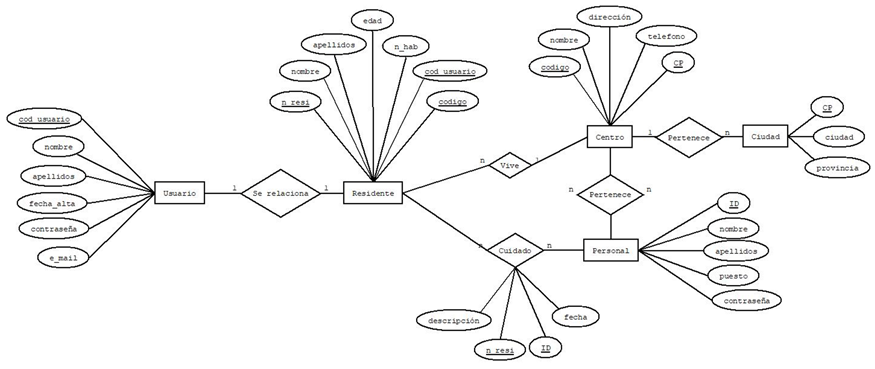

- **Diagrama de Base de Datos (DDBB)**
     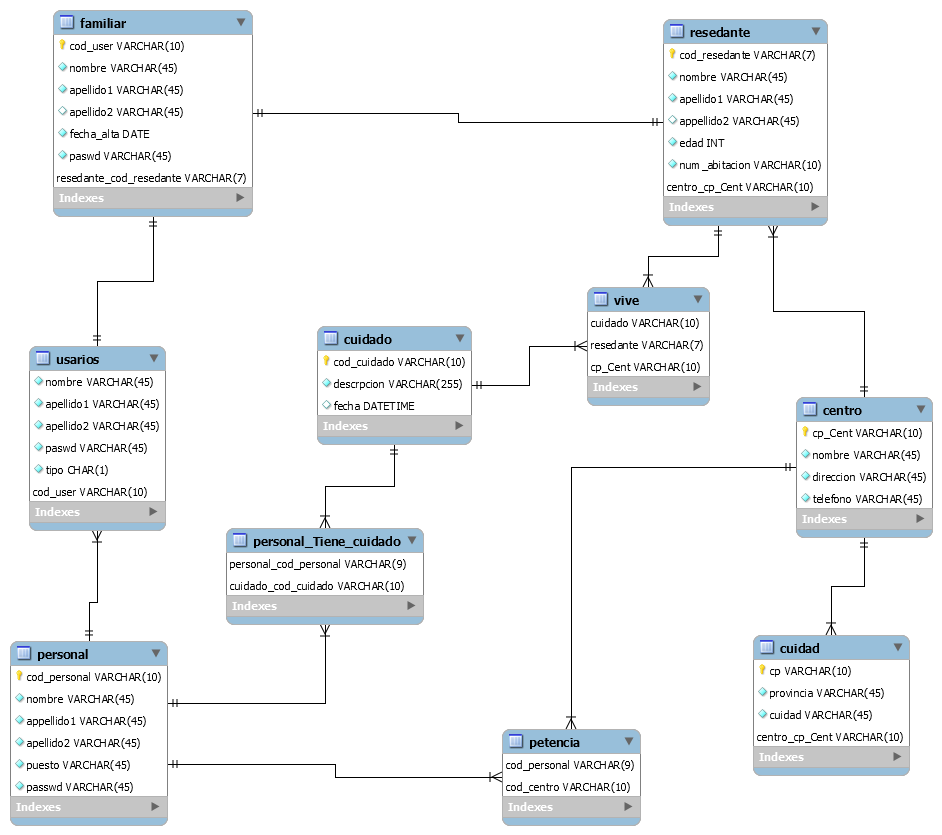

- **Diagrama de Clases**
     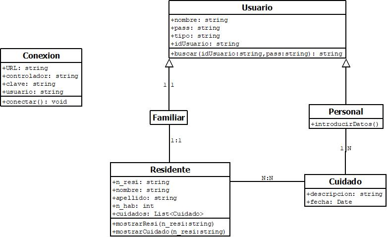

- **Diagrama de Flujo**
     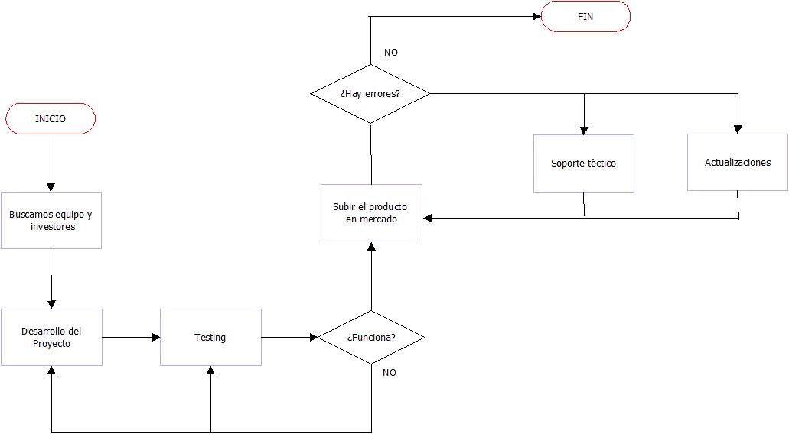

- **Diagrama de Tecnología**
     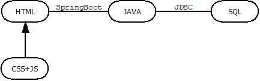

## Conexión a la BBDD en el Servidor Heroku
Aunque el proyecto ya no está en Heroku, te dejamos aquí algunos detalles sobre cómo se conectaba la base de datos en ese entorno:

- **Conexión a Heroku** 
    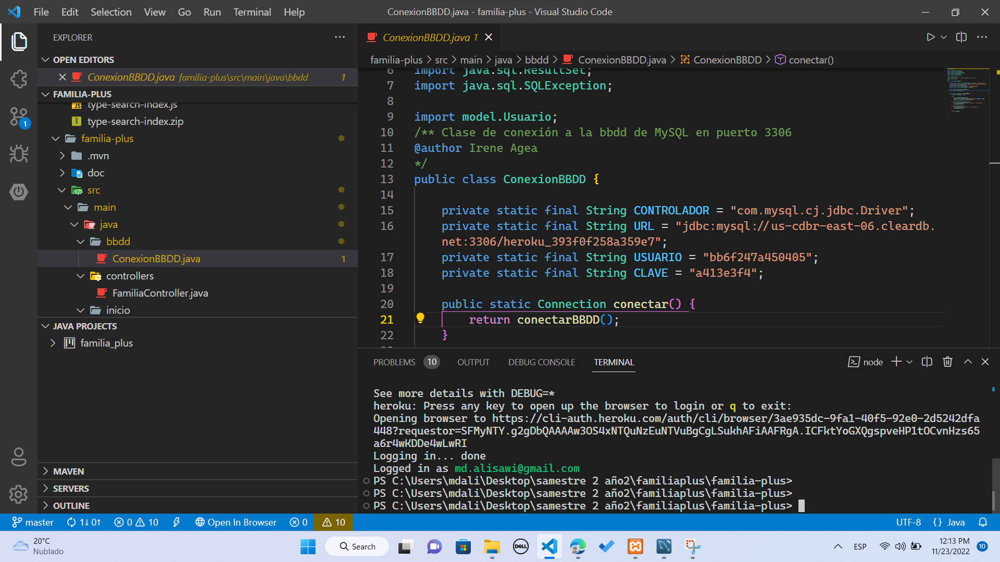

- **Conexión a Heroku** 
    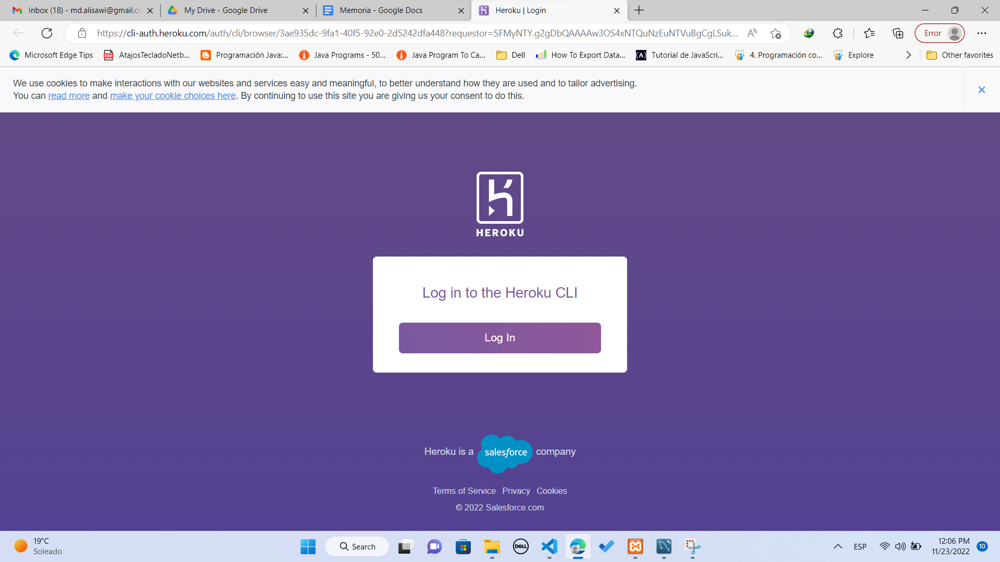

    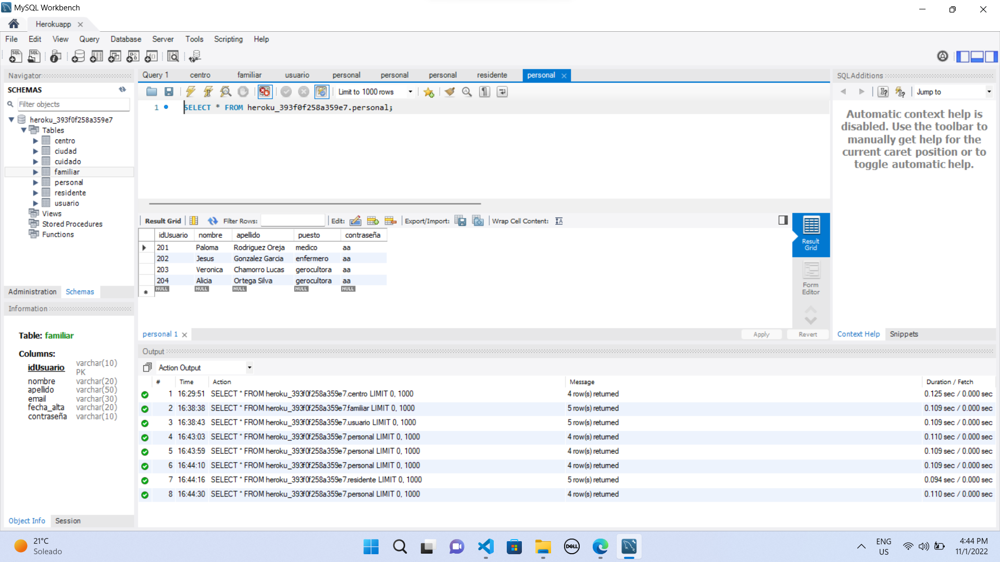

- **Test** 
    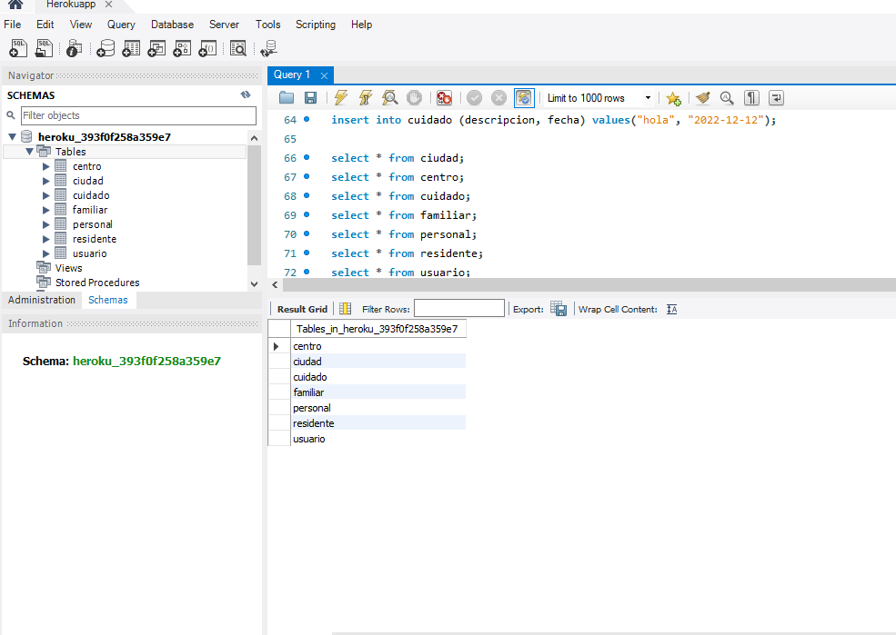

    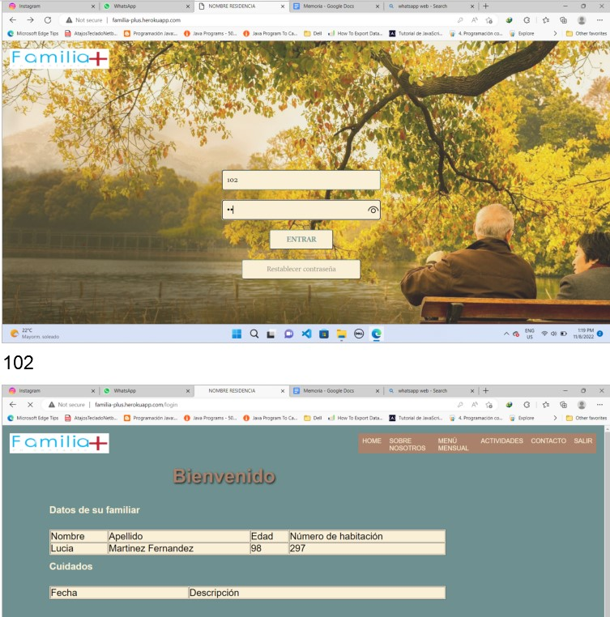

- **MVC**
     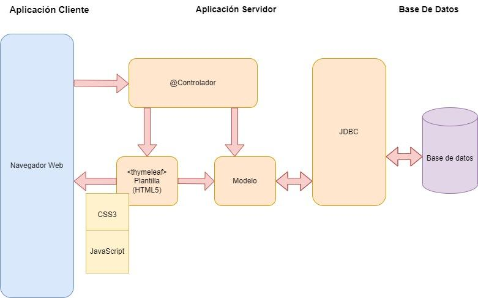
