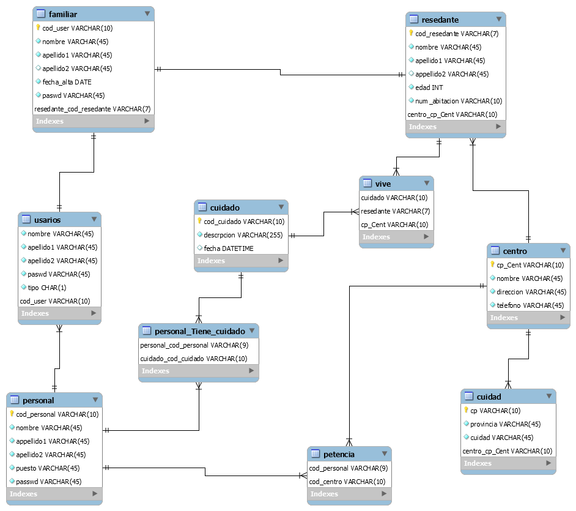

# proyecto
Proyecto DAW 2021/2023
Familia+
Equipo 06
## Asistente técnico:
-          Clasifica usuarios
-          Gestiona perfiles
-          Gestiona base de datos
-          Administra el sistema
## A continuación se muestran los diagramas de secuencias para los requisitos
     funcionales de perfiles de usuarios  más significativos: 

## Bbdd: MySQL

### Paso 1: Las entidades pasarán a ser tablas:
•   	Usuario
•       Residente
•       Cuidados
•       Personal
•       Centro.
•       PARTENCE
•       Cuidad.

### Paso 2: Los atributos de cada entidad pasarán a ser columnas de dichas tablas.

1.      USARIO (código, Nombre, Apellidos, Dirección, Email, móvil, fecha de alta.contrato,).
2.      RESIDENTE (código. nombre, edad, habitación, fecha de alta).
3.      CUIDADOS DIARIOS: (código. descripción, fecha)
4.      Personal del centro: (cod-personal. nombre. Puesto).
5.      Centro: cod.centro, nombre, dirección.teff.)
6.      Cuidad:cp,provencia,nom_cuidad,
7.      partencia:centro,personal.

#### Paso 3: Los identificadores principales :
1.      Usario: codigo-usario.                              	
2.      Residente: codigo-resedente.                              	
3.      CUIDADOS DIARIOS: código-cuidados.            	
4.      Personal del centro: código-personal
5.      Centro:código.
6.      cuidad:cp

#### Paso 4:  modelo relacional :
1.      USARIO (código, Nombre, Apellidos, Dirección, Email, móvil, fecha de alta, contrato, relación-Familiar).
2.      RESIDENTE ( codigo usario,código centro).,
3.      Pertence: código personal,código centro.
4.      Centro :cp cuidad,
5.      Cuidado:código residente,código personal.
6.      perentence:codigo centro, codigo personal.

#### BBDD corregido

    USUARIO (cod_usuario, nombre, apellidos, email, fecha_alta, contraseña).
    RESIDENTE (n_resi, nombre, apellidos, edad, n_hab, cod_usuario, código).
    CUIDADO (n_resi, ID, descripción, fecha).
    PERSONAL (ID, nombre, apellidos, puesto, contraseña).
    PERTENECE (ID, código)
    CENTRO (código, nombre, dirección, CP, teléfono).
    CIUDAD (CP, ciudad, provincia).

## c. Casos de uso Mohammed BORRADOR>

En el primer diagrama de casos de uso están 3 actores principales. 
Con el desarrollo y la expansión del programa, aquí se pueden agregar más actores y otros servicios,

lo que ampliará las capacidades del programa. 
A continuación se muestra una descripción más detallada de cada caso de uso:

## Diagramas:

## Conexion BBDD en Servidor Heroku

